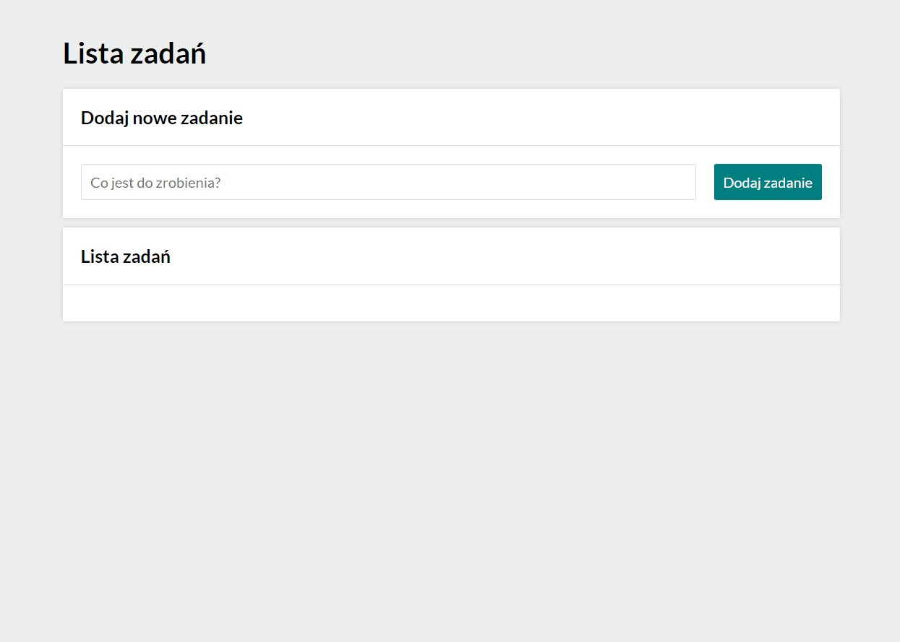

# *Task list*

## Demo

https://michalszustkiewicz.github.io/task-list/

## Description

This application has been developed as a homework during realization of the course which I attend at [YouCode](https://youcode.pl/) programming school. Using this simple app you can create a list of tasks that need to be done. By clicking the green buttons on the left side you can mark which tasks have already been done and which are still to do. There is also an option to delete a specific task from the list. For this purpose, please click the red button on the right side of the task you want to remove. In case you have some problems, you can also find a little demonstration below. Hope it will be helpful for you.

##

## Languages and technologies

- HTML
- CSS (BEM, Grid)
- JavaScript (ES6+)
